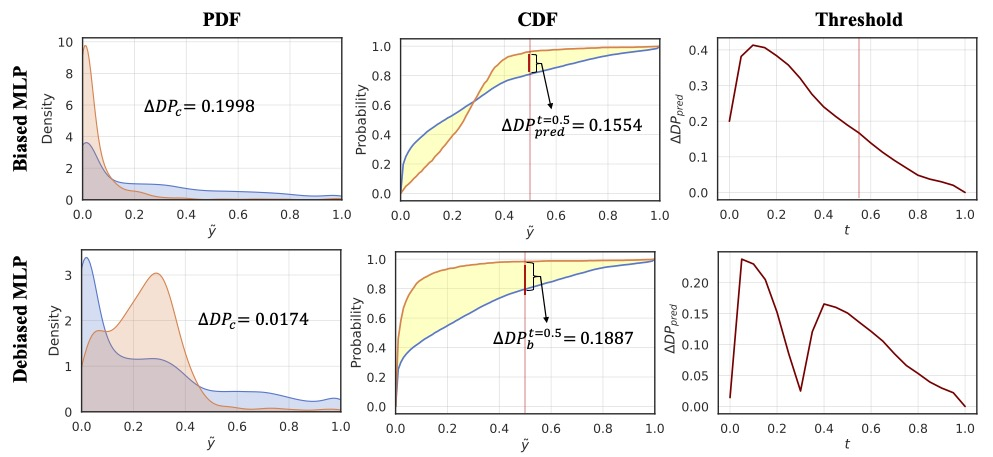

Implmentation for TMLR paper: *Retiring ΔDP: New Distribution-Level Metrics for Demographic Parity*, [[Openreview](https://openreview.net/forum?id=LjDFIWWVVa)], [[Arxiv](https://arxiv.org/abs/2301.13443)], by Xiaotian Han*, Zhimeng Jiang*, Hongye Jin*, Zirui Liu, Na Zou, Qifan Wang, Xia Hu

## 1. Introduction

Lots of fairness definitions (e.g., demographic parity, equalized opportunity) has been proposed to solve different types of fairness issues. In this paper, we focus on the measurement of demographic parity, $\Delta DP$, which requires the predictions of a machine learning model should be independent on sensitive attributes.

### 1.1 Drawbacks of commonly used $\Delta DP$ 
In this paper, we rethink the rationale of $\Delta DP$ and investigate its limitations on measuring the violation of demographic parity. There are two commonly used implementations of $\Delta DP$, including $\Delta DP_c$ (i.e., the difference of the mean of the predictive probabilities between different groups, and $\Delta DP_b$ (i.e., the difference of the proportion of positive prediction between different groups. We argue that $\Delta DP$, as a metric, has the following drawbacks:
1. **Zero-value $\Delta DP$ does not guarantee zero violation of demographic parity.** 
<p align="center">


2. **$\Delta DP$ value is highly correlated to the selection of the threshold for the classification task.** 

<p align="center">



### 1.2 The Proposed **ABPC** & **ABCC**

We propose two *distribution-level* metrics, namely **A**rea **B**etween **P**robability density function **C**urves (ABPC) and **A**rea **B**etween **C**umulative density function **C**urves (ABCC), to retire $\Delta DP_{c}$ and $\Delta DP_{b}$ as follows: 
```math
    ABPC = TV(f_0(x), f_1(x)) = ∫_{0}^{1}|f_0(x) - f_1(x) | dx,
 ```

```math
    ABCC = TV(F_0(x), F_1(x)) = ∫_{0}^{1}|F_0(x) - F_1(x)| dx,
```
 **ABPC** and **ABCC** have following advantages:
 
 1. Zero-value  **ABPC**/**ABCC** is a necessary and sufficient condition to achieve demographic parity.
 
 2. The prediction independency to sensitive attributes can be guaranteed over any threshold. 


## 2. Implementation 


### 2.1 Python package
```
torch                         1.10.0
statsmodels                   0.13.1
scikit-learn                  1.0.1
pandas                        1.3.4
numpy                         1.21.2
aif360                        0.4.0
```

### 2.2 Run cmd 
run the following commands at current directy
```
bash run.sh
```

```python
python -u ./src/bs_tabular_mlp.py --data_path ./data/adult  --dataset adult --sensitive_attr sex --exp_name adult_mlp --batch_size 256 --epoch 10 --seed 31314
python -u ./src/bs_tabular_reg.py --data_path ./data/adult  --dataset adult --sensitive_attr sex --exp_name adult_reg --batch_size 256 --epoch 10 --seed 31314 --lam 1
python -u ./src/bs_tabular_adv.py --data_path ./data/adult --dataset adult --sensitive_attr sex --exp_name adult_adv --batch_size 256 --epoch 40 --seed 31314 --lam 170
```

### 2.3 Python Implementation for ABPC and ABCC
```python
def ABPC( y_pred, y_gt, z_values, bw_method = "scott", sample_n = 5000 ):

    y_pred = y_pred.ravel()
    y_gt = y_gt.ravel()
    z_values = z_values.ravel()

    y_pre_1 = y_pred[z_values == 1]
    y_pre_0 = y_pred[z_values == 0]

    # KDE PDF     
    kde0 = gaussian_kde(y_pre_0, bw_method = bw_method)
    kde1 = gaussian_kde(y_pre_1, bw_method = bw_method)

    # integration
    x = np.linspace(0, 1, sample_n)
    kde1_x = kde1(x)
    kde0_x = kde0(x)
    abpc = np.trapz(np.abs(kde0_x - kde1_x), x)

    return abpc

```

```python
def ABCC( y_pred, y_gt, z_values, sample_n = 10000 ):

    y_pred = y_pred.ravel()
    y_gt = y_gt.ravel()
    z_values = z_values.ravel()

    y_pre_1 = y_pred[z_values == 1]
    y_pre_0 = y_pred[z_values == 0]

    # empirical CDF 
    ecdf0 = ECDF(y_pre_0)
    ecdf1 = ECDF(y_pre_1)

    # integration
    x = np.linspace(0, 1, sample_n)
    ecdf0_x = ecdf0(x)
    ecdf1_x = ecdf1(x)
    abcc = np.trapz(np.abs(ecdf0_x - ecdf1_x), x)

    return abcc
```

## 3. Citation
Please kindly cite the following paper if you found our code helpful!
```bibtex
  @article{han2023retiring,
    title={Retiring $$\backslash$Delta $ DP: New Distribution-Level Metrics for Demographic Parity},
    author={Han, Xiaotian and Jiang, Zhimeng and Jin, Hongye and Liu, Zirui and Zou, Na and Wang, Qifan and Hu, Xia},
    journal={arXiv preprint arXiv:2301.13443},
    year={2023}
  }
```


## 4. Credit
We use Github Copilot to generate some comments in important code. 